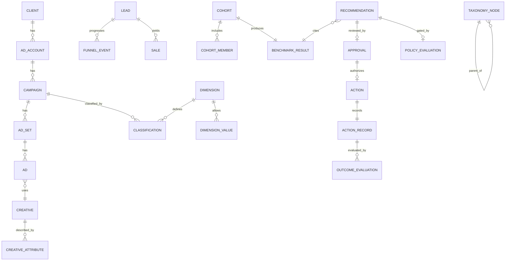

# 03 — Database Model

Physical model for the Normalized Data Warehouse and supporting stores. Target
engine: **PostgreSQL** (JSONB + window functions + pgvector). The model is
organized into logical **schemas** that mirror the bounded contexts in
[02](./02-domain-model.md).

Conventions:
- Surrogate PKs are `uuid` (`id`). External platform ids are stored separately
  (`external_id`) and never used as internal keys.
- Every tenant-scoped table carries `client_id` (RLS enforced — see
  [09](./09-security-model.md)).
- Timestamps are `timestamptz` in UTC. Money is stored in minor units with an
  explicit `currency`.
- Mutable business rows are append-only where auditability matters (versioned).

## Schemas

| Schema | Purpose |
|--------|---------|
| `ingest` | Raw landing zone + sync bookkeeping |
| `core` | Canonical advertising entities |
| `facts` | Time-series performance facts |
| `taxonomy` | Taxonomy tree, dimension registry, classifications, creative metadata |
| `crm` | Pseudonymized leads, funnel events, sales |
| `knowledge` | Playbooks, rules, benchmarks, optimization policies |
| `intel` | Cohorts, benchmark results, anomalies, recommendations |
| `control` | Approvals, actions, action records, outcome evaluations, audit |
| `iam` | Clients, users, roles, permissions |

---

## `ingest` — raw landing zone

```
ingest.raw_payload
  id            uuid pk
  source        text            -- 'meta', 'google', 'crm:hubspot', ...
  entity_kind   text            -- 'campaign', 'insight', 'lead', ...
  external_ref  text
  fetched_at    timestamptz
  payload       jsonb           -- immutable raw
  checksum      text            -- dedupe / idempotency
  sync_run_id   uuid fk -> ingest.sync_run

ingest.sync_run
  id            uuid pk
  connector     text
  client_id     uuid
  window_start  timestamptz
  window_end    timestamptz
  status        text            -- running | success | failed | partial
  stats         jsonb           -- rows, retries, rate-limit hits
  started_at / finished_at
```

Raw payloads make ingestion **replayable** and provide lineage for every derived
number.

---

## `core` — canonical advertising entities

```
core.platform            (id, key, display_name)
core.ad_account          (id, client_id, platform_id, external_id, name,
                          currency, timezone, maturity, status, created_at)
core.campaign            (id, client_id, ad_account_id, external_id, name,
                          objective, status, maturity, first_seen_at, raw_ref)
core.ad_set              (id, client_id, campaign_id, external_id, name,
                          status, targeting jsonb, budget_minor bigint,
                          budget_type, schedule jsonb, maturity)
core.ad                  (id, client_id, ad_set_id, creative_id, external_id,
                          name, status)
core.creative            (id, client_id, external_id, format, asset_ref,
                          fingerprint, embedding vector(1024) null)
```

`status`/`maturity` are enumerated in reference tables so lifecycle vocabulary is
consistent across platforms. `embedding` (pgvector) supports creative similarity;
it is nullable and populated later.

---

## `facts` — time-series performance

Narrow, additive fact tables keyed by entity + grain + date. Partitioned by month.

```
facts.entity_daily
  id            uuid pk
  client_id     uuid
  entity_type   text            -- account | campaign | ad_set | ad | creative
  entity_id     uuid
  date          date
  currency      text
  spend_minor        bigint
  impressions        bigint
  clicks             bigint
  conversions        numeric
  conversion_value_minor bigint
  platform_metrics   jsonb      -- platform-specific extras, typed on read
  data_quality       jsonb      -- freshness, completeness flags
  UNIQUE (client_id, entity_type, entity_id, date)
```

All benchmark math reads from `facts.*` (never from raw). Because facts are
deterministic functions of raw payloads, engine outputs are **reproducible**.

---

## `taxonomy` — extensible taxonomy, dimensions, classifications

The extensibility guarantee lives here: **new verticals, subcategories,
dimensions, and creative attributes are rows, not migrations.**

```
taxonomy.node                       -- the industry tree
  id         uuid pk
  parent_id  uuid null fk -> taxonomy.node
  key        text            -- 'rhinoplasty'
  label      text
  level      int
  path       ltree/text      -- 'health-tourism/rhinoplasty'  (unique)
  metadata   jsonb

taxonomy.dimension                  -- the context dimension registry
  id         uuid pk
  key        text unique     -- 'platform', 'budget_range', 'creative_angle'
  label      text
  value_type text            -- enum | taxonomy_ref | range | embedding | free
  config     jsonb           -- allowed values / bucketing / comparator params

taxonomy.dimension_value            -- controlled vocab for enum/range dims
  id           uuid pk
  dimension_id uuid fk
  value        text
  ordinal      int null        -- for ranges / bands
  metadata     jsonb

taxonomy.classification             -- (entity, dimension) -> value
  id           uuid pk
  client_id    uuid
  entity_type  text
  entity_id    uuid
  dimension_id uuid fk
  value        text            -- fk-ish to dimension_value, or free/embedding ref
  source       text            -- ingested | rule | ai-suggested | human
  confidence   numeric
  valid_from   timestamptz
  valid_to     timestamptz null  -- versioned; null = current
  UNIQUE (entity_type, entity_id, dimension_id, valid_from)

taxonomy.creative_attribute         -- structured creative metadata (versioned)
  id           uuid pk
  creative_id  uuid fk -> core.creative
  attribute    text            -- 'hook', 'doctor_presence', 'message_angle'
  value        text
  source       text            -- ai-suggested | human | ingested
  confidence   numeric
  valid_from / valid_to
```

**Why this satisfies "extensible without schema changes":** to add
`subcategory = 'implants'` you insert a `taxonomy.node`; to add a new dimension
`ad_placement` you insert a `taxonomy.dimension` (+ its values); classifications
reference dimensions by id. No DDL. Comparators for similarity read
`dimension.config`, so cohort logic adapts to new dimensions by configuration.

---

## `crm` — pseudonymized outcomes (first-class)

PII never lands here; only pseudonymous ids and computed outcome attributes (see
[09](./09-security-model.md)).

```
crm.lead
  id            uuid pk
  client_id     uuid
  pseudonym_id  text            -- opaque, stable, non-reversible in this store
  ad_account_id uuid null
  attributed_entity_type text null
  attributed_entity_id   uuid null
  source_platform text
  created_at    timestamptz
  lead_quality  text null       -- computed band
  attributes    jsonb           -- non-PII qualifiers only

crm.funnel_stage                -- per-vertical ordered stage definitions (data)
  id, vertical_node_id, key, label, ordinal

crm.funnel_event
  id, client_id, lead_id, stage_id, occurred_at, value_minor null, metadata

crm.sale
  id, client_id, lead_id, occurred_at, revenue_minor, margin_minor null,
  customer_value_minor null, sales_quality text null, currency
```

Funnel stages are **data**, so Health Tourism, E-commerce and Services each define
their own funnels without schema change.

---

## `knowledge` — Strategy Memory

```
knowledge.playbook
  id, scope jsonb (vertical/subcategory/platform/market), title, body_md,
  version, status, effective_from, source

knowledge.rule                  -- deterministic rule definitions used by Decision Engine
  id, scope jsonb, key, definition jsonb, priority, version, enabled

knowledge.benchmark_ref         -- curated/known benchmarks (distinct from computed cohort benchmarks)
  id, scope jsonb, metric, value numeric, unit, sample jsonb, source, version

knowledge.optimization_policy   -- per-client policy consumed by Policy Engine
  id, client_id, definition jsonb, version, enabled, effective_from
```

`scope jsonb` uses dimension keys (e.g. `{vertical:'health-tourism',
subcategory:'rhinoplasty', platform:'meta', market:'uk'}`) so knowledge maps to
resource URIs like `rtn://benchmarks/health/rhinoplasty/uk`.

---

## `intel` — deterministic intelligence outputs

```
intel.cohort
  id, client_id, subject_entity_type, subject_entity_id, created_at,
  weighting jsonb          -- similarity/recency/sample/quality params used

intel.cohort_member
  id, cohort_id, member_entity_type, member_entity_id,
  similarity numeric, influence numeric   -- persisted for audit/reconstruction

intel.benchmark_result
  id, cohort_id, metric, subject_value numeric, distribution jsonb,
  percentile numeric, computed_at

intel.anomaly
  id, client_id, entity_type, entity_id, metric, kind, severity,
  detected_at, evidence jsonb

intel.recommendation             -- see §recommendation model in 02
  id, client_id, entity_type, entity_id, type,
  recommended_action jsonb, reasoning text, supporting_metrics jsonb,
  benchmark_result_id uuid fk, confidence numeric, confidence_detail jsonb,
  risk_level text, expected_outcome jsonb, evidence_window jsonb,
  observation_period interval, causal_support text, model_provenance jsonb,
  status text, created_at
```

`model_provenance` records which LLM provider/model/version drafted the narrative
(model-agnostic auditability). Numbers in `supporting_metrics`/`benchmark_result`
are copied from deterministic sources; the LLM cannot write here directly.

---

## `control` — Decision Memory & audit (immutable)

```
control.approval
  id, recommendation_id fk, decided_by (user), decision (approve|reject),
  decided_at, note

control.action
  id, recommendation_id fk, approval_id fk, entity_type, entity_id,
  action_type, requested_change jsonb, policy_evaluation_id fk, status,
  created_at

control.action_record            -- immutable, one per executed action
  id, action_id fk,
  pre_state jsonb, executed_change jsonb, post_state jsonb null,
  executed_at, executed_by (system/user), platform_response jsonb,
  rollback_ref uuid null, evaluation_window jsonb, result text null

control.outcome_evaluation
  id, action_record_id fk, evaluated_at, window jsonb,
  metrics_before jsonb, metrics_after jsonb, delta jsonb,
  result text, causal_confidence numeric

control.policy_evaluation
  id, recommendation_id fk, policy_version, input jsonb, decision text,
  violated_constraints jsonb, evaluated_at

control.audit_entry              -- append-only, hash-chained
  id, seq bigserial, client_id, actor, actor_kind (user|system|llm),
  action, subject_ref, payload jsonb, prev_hash, hash, created_at
```

`control.audit_entry` is **append-only and hash-chained** (`hash =
H(prev_hash || payload)`) to make tampering detectable. `action_record` is never
updated in place except to attach `post_state`/`result` via a linked
`outcome_evaluation`.

---

## `iam` — identity & access

```
iam.client        (id, name, status, settings jsonb)
iam.user          (id, email, name, status)
iam.membership    (id, user_id, client_id, role)          -- user↔client scoping
iam.role          (id, key, description)
iam.permission    (id, role_id, capability, constraints jsonb)
```

See [10-permission-model](./10-permission-model.md).

---

## ERD (logical)



## Indexing & performance notes

- `facts.entity_daily`: partition by month; index `(client_id, entity_type,
  entity_id, date)` and `(client_id, date)` for cohort scans.
- `taxonomy.classification`: partial index `WHERE valid_to IS NULL` for "current
  context".
- `core.creative.embedding`: ivfflat/hnsw index for creative similarity.
- `intel.cohort_member`: index `(cohort_id, influence DESC)`.
- `control.audit_entry`: index `(client_id, seq)`; never deleted.

## Data quality & weighting inputs

`facts.*.data_quality` and `ingest.sync_run.stats` feed the `q(data_quality)` and
`h(sample_size)` weighting functions (see [02 §5](./02-domain-model.md)). Recency
weighting uses `facts.date`; the half-life is configured in `knowledge.rule`.
